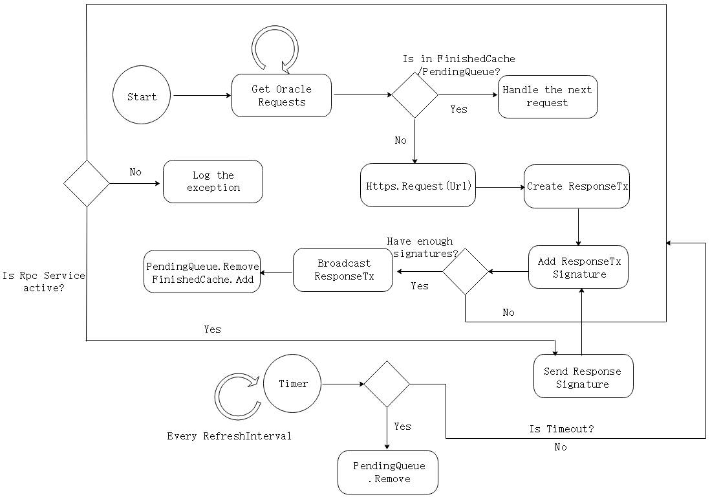
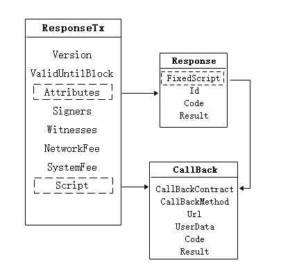

区块链因其链上数据的不可篡改性与透明性而有着巨大价值。但是当前的智能合约无法主动向外部获取链外信息，使得它只能在一个封闭、孤立的环境中执行任务，无法做到和外部世界的互通互连。

预言机（Oracle）的出现旨在为区块链解决上述问题，作为智能合约与外部世界通信的网关，为区块链打开了一扇通往外部世界的窗户。对于链外请求到的数据，Oracle会通过多方验证来保证结果的准确性，并将结果以区块的形式在链上存储供合约访问。基于此服务行为，Oracle节点会收取一定交易费用。在Neo网络中，可用GAS支付Oracle交易。

# Neo Oracle

Neo提供了内置的Oracle服务，以原生合约的形式供其他合约调用。为了获取链外的网络数据，合约首先需构造Oracle请求交易，部署上链后则可使用Neo Oracle服务。一个合约可发起多次Oracle请求，存储时会为不同请求自动生成不同的id字段加以区分，Oracle响应通过该Id字段实现与Oracle请求的一一对应。Oracle请求由网络中的Oracle节点进行处理，其中Oracle节点由委员会选举得出。Oracle节点需安装Oracle插件并启动Oracle服务后，才能处理网络中的Oracle请求。启动服务后节点将对链上的Oracle请求进行处理，通过请求中的Url查询结果，启动过滤器对结果进行过滤，并通过将结果附加到交易的TransactionAttribute部分构造响应交易。Oracle节点会对响应交易进行链下共识，当收集到足够数量的签名后将交易广播至网络。一旦收集到足够的签名，就可以将Oracle交易视为已验证，并执行交易脚本调用Oracle请求的回调函数。

<div align=center></div>

# Oracle 插件

节点在提供Oracle服务时，需要安装相应的Oracle插件。Oracle节点的工作流程如下：
<div align=center></div>

1. Oracle节点通过在neo-cli交互式命令行输入`start oracle`开启Oracle服务；
2. 获取网络中所有未处理的Oracle请求，并对每一条请求执行以下操作：
    1. 若该请求在`FinishedCache`中，则执行下一条请求；
    2. 若该请求在`PendingQueue`中，且响应交易不为null，则执行下一条请求；
    3. 否则，执行步骤3；
3. 根据Url发起`Https Get`请求，并使用过滤器对返回结果进行过滤，得到所需数据；
4. 构建响应交易，并对交易进行签名；
5. 检查收集到的交易签名数量：
    1. 若节点收集到`N-(N-1)/3`个交易签名，则将交易进行广播；
    2. 否则，使用Rpc服务将签名发送至其他的Oracle节点进行链下共识

此外，节点会启动一个计时器，每隔`RefreshInterval`的时间对`PendingQueue`的任务进行处理：
1. 若任务在队列中的时间超过了`MaxTaskTimeout`,则将该超时任务从`PendingQueue`移除；
2. 若任务在队列中的时间在区间`(RefreshInterval, RefreshInterval*2)`中，则执行上述步骤5.2
## Oracle Request

用户通过调用Oracle原生合约内的`Request`方法发起Oracle请求。方法需要提供以下参数：

| 字段      | 字节数    | 描述                                         |
| ---------- | --------- | ----------------------------------------------- |
| Url    | string  | 请求的Url |
| Filter | string  | 过滤器，可用于过滤无用数据                       |
| CallbackContract   | 20 bytes   | 回调合约                      |
| CallbackMethod     | string | 回调方法名                      |
| UserData     | var bytes | 用户提供的额外数据                      |
| GasForResponse   | long  |  获取响应所需的费用，由调用Oracle服务的合约设置                                   |

### Url
使用Neo Oracle服务所请求的Url需使用HTTP/HTTPS网络传输协议，这是基于互联网的数据交换标准。Oracle节点将基于此Url通过发起`GET`请求检索相关的网络资源。
### Filter

过滤器用于在从数据源返回的结果中过滤出有用信息，当前以JSONPath标准过滤不必要的数据。为了与过滤器相匹配，当前仅支持JSON响应。更多关于JSONPath的信息，可点击[此处](https://github.com/json-path/JsonPath)查看。

### GasForResponse

用于支付获取响应交易的费用，包括系统费与网络费。GasForResponse应是不小于0.1 GAS的值，若费用不足响应交易会执行失败。
## Oracle Response

Oracle节点获取到所需数据后，将构造响应交易并附加上自己的签名向网络中其他的Oracle节点进行广播进行链下共识。响应交易的结构如下：

<div align=center></div>

响应交易的`Attributes`属性设置为`Response`，表明该交易为响应交易，用于区分网络中其他类型的交易。交易的`Script`字段与`Response`属性的`FixedScript`一致，脚本功能是调用Oracle合约内定义的`finish`方法，从而执行用户自定义的回调函数。
### Code
Code字段定义了响应交易的执行结果，包括以下8种类型：

| 值    | 名称| 说明| 类型|
|---------------|-------------|---------------|--------------|
| `0x00`           | `Success`          | 执行成功   | `byte`  |
| `0x10`           | `ConsensusUnreachable`          | 共识不可达    | `byte`  |
| `0x12`           | `NotFound`          | 请求的信息不存在    | `byte`  |
| `0x14`           | `Timeout`          | 执行超时    | `byte`  |
| `0x16`           | `Forbidden`          | 无执行权限    | `byte`  |
| `0x18`           | `ResponseTooLarge`          | 响应结果过大    | `byte`  |
| `0x1a`           | `InsufficientFunds`          | 手续费不足    | `byte`  |
| `0xff`           | `Error`          | 执行错误    | `byte`  |

## 示例合约

```C#
    public class OracleDemo : SmartContract
    {
        public static void DoRequest()
        {
            string url = "http://127.0.0.1:8080/test";
            string filter = "$.value";  // JSONPath, { "value": "hello world" }
            string callback = "callback";
            object userdata = "userdata"; // arbitrary type
            long gasForResponse = 10000000; // minimum fee 

            Oracle.Request(url, filter, callback, userdata, gasForResponse);
        }

        public static void Callback(string url, string userdata, int code, string result)
        {
            object ret = Json.Deserialize(result); // [ "hello world" ]
            object[] arr = (object[])ret;
            string value = (string)arr[0];

            Runtime.Log("userdata: " + userdata);
            Runtime.Log("response value: " + value);
        }
    }
```