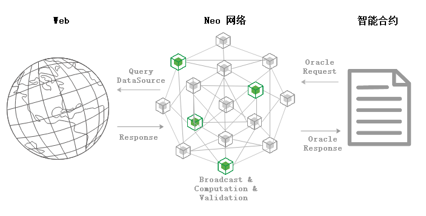

区块链因其链上数据的不可篡改性与透明性而有着巨大价值。但是当前的智能合约无法主动向外部获取链外信息，使得它只能在一个封闭、孤立的环境中执行任务，无法做到和外部世界的互通互连。

预言机（Oracle）的出现旨在为区块链解决上述问题，作为智能合约与外部世界通信的网关，为区块链打开了一扇通往外部世界的窗户。对于链外请求到的数据，Oracle会通过多方验证来保证结果的准确性，并将结果以区块的形式在链上存储供合约访问。基于此服务行为，Oracle节点会收取一定交易费用。在Neo网络中，可用GAS支付Oracle交易。

# Neo Oracle

Neo提供了内置的Oracle服务，以原生合约的形式供其他合约调用。为了获取链外的网络数据，合约首先需构造Oracle请求交易，部署上链后则可调用Neo Oracle服务。除了Oracle的节点（由委员会选举）外，网络中的所有节点也会协助交易的运行。当Oracle交易广播到网络中后，每个节点会将当前未验证的交易作为已知的哈希存储在其内存池中，并将其传递给其他节点。

通过此过程，发现Oracle交易的Oracle节点将使用URL并应用过滤器来完成所有包含的请求。然后，通过将结果附加到Oracle交易的TransactionAttribute部分，这些节点将就返回响应的数据达成共识。

一旦收集到足够的签名，就可以将Oracle交易视为已验证，并由共识节点将其存储在一个区块中，待区块上链后即可供合约访问。

## Oracle Request
| 字段      | 字节数    | 描述                                         |
| ---------- | --------- | ----------------------------------------------- |
| OriginalTxid      | 32 bytes   | 包含请求的交易Id                                     |
| GasForResponse   | long  |  获取响应所需的费用，由调用Oracle服务的合约设置                                   |
| Url    | string  | 请求的Url |
| Filter | string  | 过滤器，可用于过滤无用数据                       |
| CallbackContract   | 20 bytes   | 回调合约                      |
| CallbackMethod     | string | 回调方法名                      |
| UserData     | var bytes | 用户提供的额外数据                      |

## Oracle Response
| 字段      | 字节数    | 描述                                         |
| ---------- | --------- | ----------------------------------------------- |
| Id      | ulong   |Oracle Request的Id                                    |
| Code   | byte  | Oracle 响应编码                                   |
| Result    | var bytes  | 响应内容 |

### Code
Code字段定义了响应交易的执行结果，包括以下五种类型：

| 值    | 名称| 说明| 类型|
|---------------|-------------|---------------|--------------|
| `0x00`           | `Success`          | 执行成功   | `byte`  |
| `0x01`           | `NotFound`          | 请求的信息不存在    | `byte`  |
| `0x12`           | `Timeout`          | 执行超时    | `byte`  |
| `0x14`           | `Forbidden`          | 无执行权限    | `byte`  |
| `0xff`           | `Error`          | 执行错误    | `byte`  |