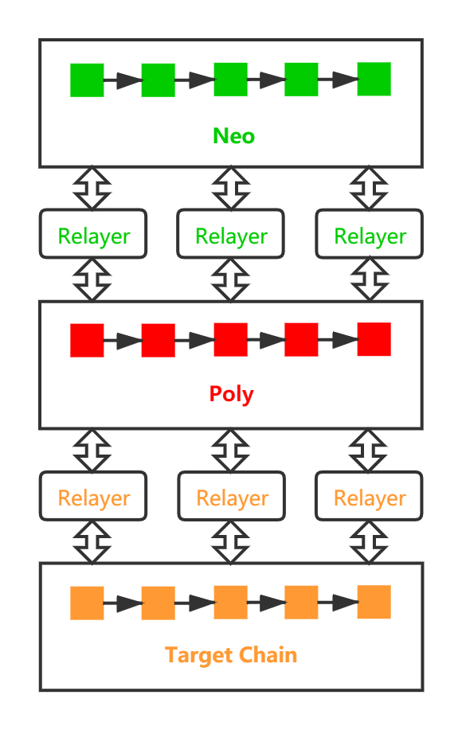
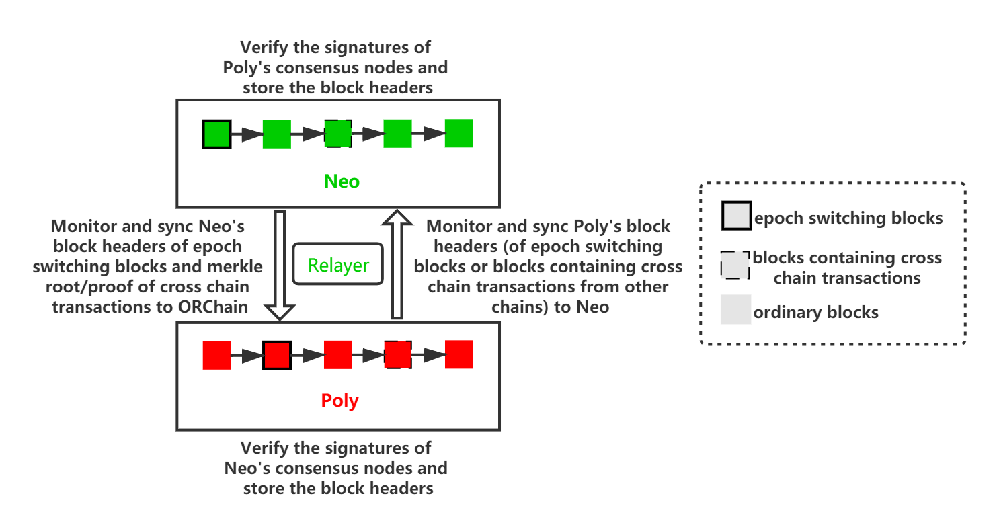
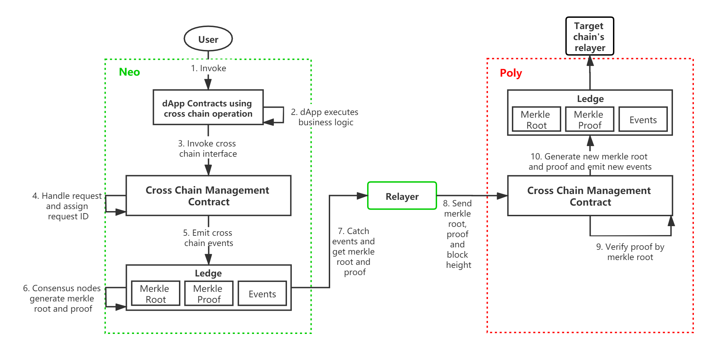
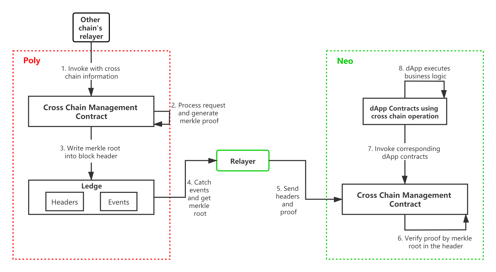

# Poly Network

跨链技术是在现有的单条区块链架构设计的基础上通过跨链互操作协议打通链与链之间交互的一种新的技术手段。跨链互操作协议最早在 2016 年 9 月由 Vitalik Buterin 首次提出，他将跨链互操作协议分为三种模式: 公证人机制 (Notary schemes)、侧链/中继 (Sidechains/relays)、哈希时间锁 (Hash locking)。公证人机制是指在跨链交互的过程中通过一个信任的第三方来交互，主要通过“单签、多签公证人机制” 等机制实现；侧链/中继模式是现在使用比较多的协议，它是指不需要依赖可信的第三方进行跨链交易的验证，可以自行进行跨链交易验证的一种技术手段；哈希时间锁是最早闪电网络的底层技术，它将该协议分为时间锁和哈希锁，时间锁指交易双方约定在某个时间内提交才有效，超时则承诺方案失效（无论是提出方或接受方）。哈希锁指对一个哈希值H，如果提供原像R使得 Hash(R) = H，则承诺有效，否则失效。如果交易双方因为各种原因未能成功，时间锁能够让交易参与各方拿回自己资金，避免因欺诈或交易失败造成的损失。

Poly Network基于侧链/中继模式，采用双层结构设计，使用Poly中继链作为跨链协调器，多条异构链作为跨链交易执行器，Relayer作为跨链信息的搬运工，通过解决跨链信息的有效性、安全性和事务性等问题，实现了一套安全、易用、高效的跨链体系。

## 特性
* 轻量级跨链协议
* 接入简单方便
* 同时支持同构链和异构链
* 支持跨链事务强一致性和最终一致性
* 资产跨链超级，同时支持资产跨链和任意信息跨链
* 跨链协议安全可靠，以密码学为基石
* 支持异构链协议范围广（BTC/ETH/NEO/Ontology/Cosmos）
* 中继链是开放式准入的公链

# Neo跨链设计

## 概述

目前在Neo上有两种方式可以实现跨链操作：一种是通过节点如Neo-CLI和Neo-GUI等调用合约发送跨链交易，另一种是通过SDK构造跨链交易。

## 跨链的实现

以资产跨链为例，用户把资产在原链上锁定，之后在目标链上发行映射资产，同时可以在目标链上申请提现，最后在原链上解锁。要实现该过程，则需要目标链可以验证原链上发生的行为，即验证原链上确实锁定了一定数量的原资产。

非资产类的信息跨链也是如此，需要目标链验证原链上的信息变化，从而做出相应的变化。

这种验证过程目前都是通过merkle证明的形式实现的，即原链将其上发生的行为存储下来，并构造一棵merkle tree，然后将merkle tree的树根root和该行为的proof提交给目标链。目标链根据提交的merkle root验证proof的合法性，从而确定原链上发生的行为。

## 架构

上图显示了Neo跨链生态的架构，从上到下分别是Neo链、Neo链的Relayer、中继链Poly、目标链的Relayer和目标链。简单来说，用户在Neo链上发出的跨链交易的证明会经由Relayer传递到Poly，再由目标链的Relayer传递到目标链，目标链验证Neo链上的交易证明并执行相应的交易。反之亦然。

生态中的角色定义如下：

- **中继链 Poly**：中继链是整个生态中的重要部分，每个节点由不同的个人或组织运行，有自己独特的治理模式和信任机制，它负责将各个链连接到一起和跨链信息的传递。
- **Relayer**：每条链都有自己的Relayer，它们负责把交易等跨链信息搬运到中继链或从中继链搬运到源链，并且它们会在这个过程中获取收益。
- **应用**：应用是指开发跨链业务的人或组织，任何人都可以部署跨链合约来构建跨链应用，然后把应用公开出去招揽用户。
- **用户**：对跨链生态来说，最重要的就是用户，通过调用具有跨链功能的应用，实现Neo到以太坊等链的跨链业务。

## Neo链和中继链之间的区块头同步

上图展示了Neo链和中继链之间同步区块头的具体流程：

一方面，Neo链的共识节点由Neo持有者实时投票选举产生，理论上每个区块的验证者集合都可能变化。若验证者集合保持不变，则不需要同步该区块头，只需要同步关键区块头（即包含切换了验证者集合后的区块头），这样可以大大减少需要同步的区块头数量。同时由于Neo的merkle root不包含在区块头中，而是由共识节点独立签名并广播，所以当有跨链交易发生时，Relayer会把这些交易所在区块的merkle root和proof以及区块高度转发给中继链，中继链仅更新一下当前已同步的Neo链的高度并转发merkle root和proof。

另一方面，中继链区块头由Relayer同步到Neo链，Neo链的跨链管理合约会验证区块头的合法性，并存储区块头，该链的其它任何合约都可以从该合约中读取同步的区块头。

## Neo链和中继链之间的跨链交易

从Neo链到目标链的跨链流程：

1. 用户在Neo链上的业务合约中发起跨链交易；
2. 业务合约调用跨链管理合约的跨链接口，跨链管理合约处理跨链请求，分配唯一自增ID，发出跨链事件；
3. 共识节点会生成该跨链交易所在区块的merkle root和该交易的merkle proof；
4. Neo的Relayer捕获跨链事件后通过RPC调用获取上述merkle root和merkle proof以及区块高度并提交到中继链；
5. 中继链验证merkle proof的合法性，将跨链交易的信息以事件的形式广播，目标链的Relayer会监听这些事件并把发往自己链的交易捕获到，然后转发到对应目标链；
6. 目标链的跨链管理合约验证中继链merkle proof的合法性，验证通过则说明原链上的跨链信息合法，目标链的跨链管理合约会调用相应的业务合约，执行目标链上的业务逻辑。

从目标链返回到Neo链的跨链流程：

1. 用户在目标链上的业务合约中发起跨链交易；
2. 目标链的Relayer将跨链交易信息转发到中继链，调用中继链的跨链管理合约；
3. 跨链管理合约验证交易信息后，将验证后的信息存下来，并构造新的merkle tree，将树根写入中继链的区块头中，并生成跨链信息的merkle proof；
4. Neo的Relayer会监听中继链，将区块头和proof提交到Neo链；
5. Neo链的跨链管理合约会读取中继链区块头，验证中继链的proof，然后调用业务合约执行对应的逻辑。

